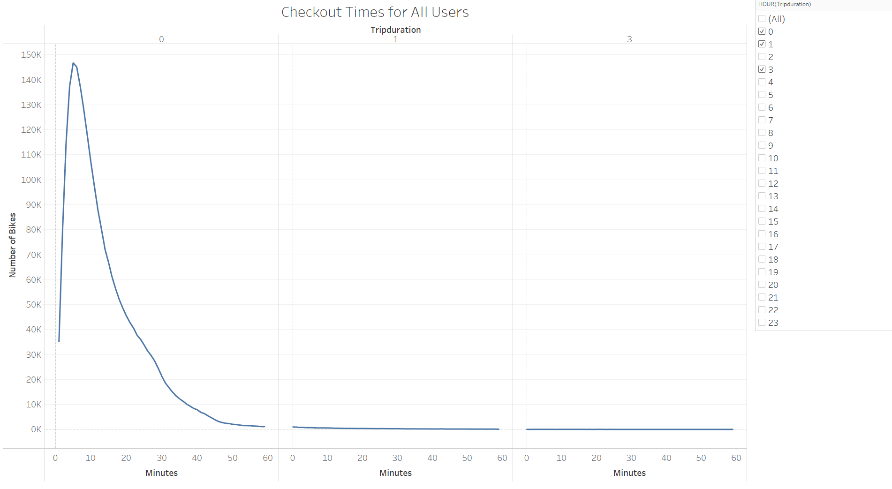
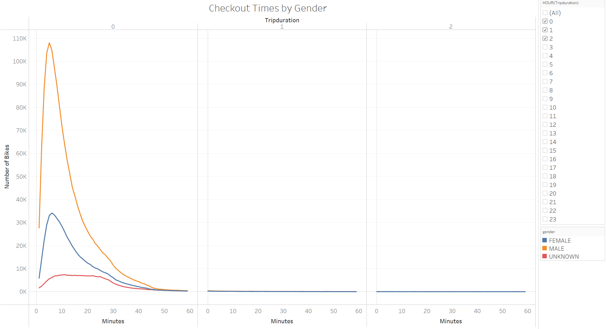
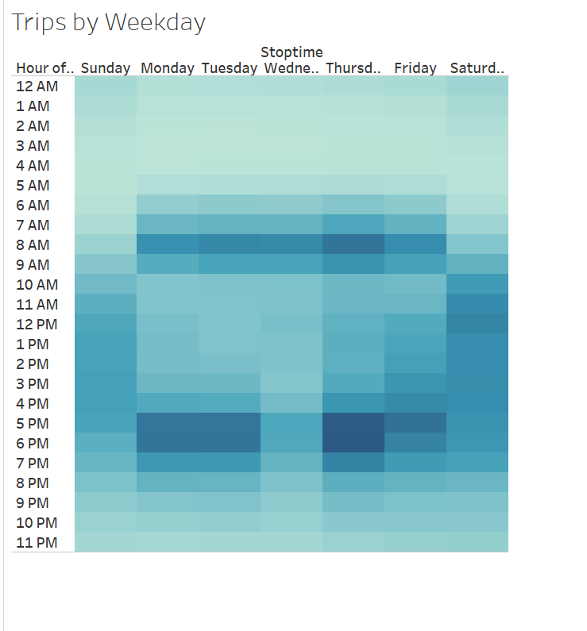
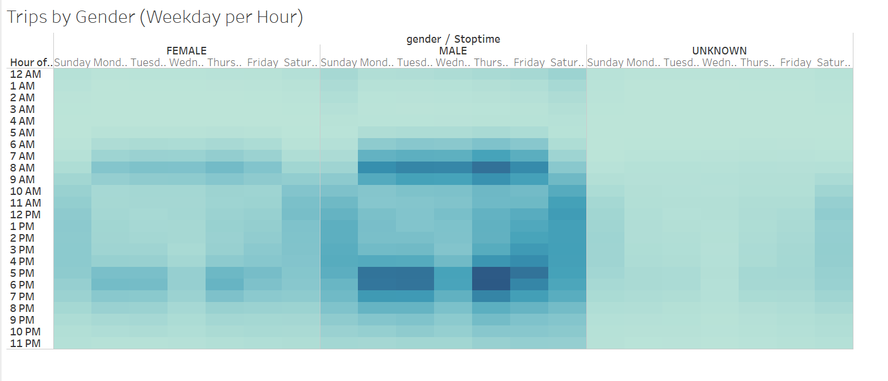
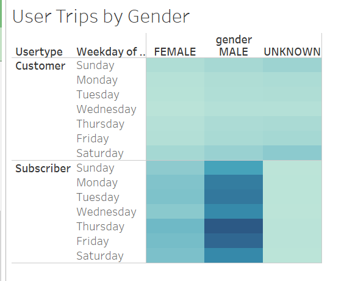
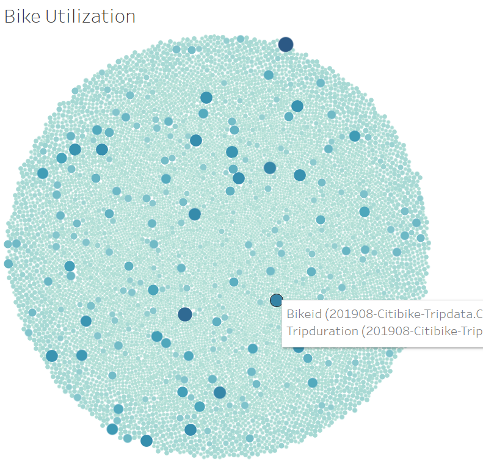
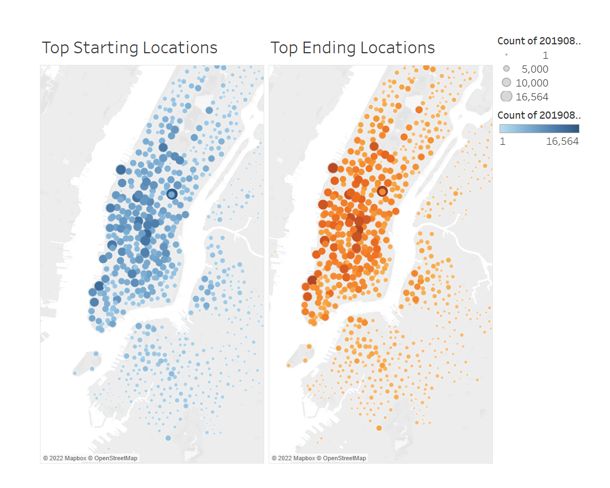
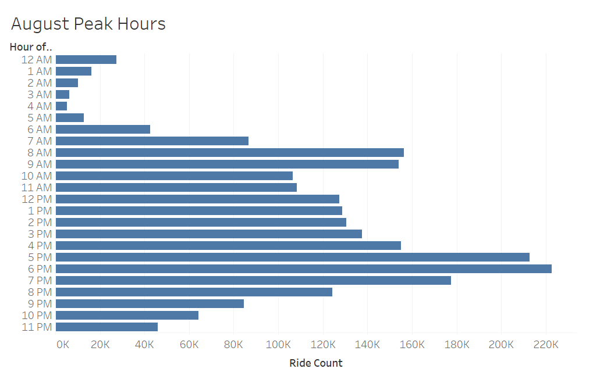

Bike Share Business Planning : NYC Citi Bike Analysis

# Overview
In this analysis, we use Tableau to visualize bike trip data from NYC Citi Bike, a bike sharing service, in August 2019. Our goal is to draw useful conclusions about the feasibility and operational details of a similar bike sharing service in Des Moines, IA. 

# Results

## Checkout Times for All Users
This visualization shows the length of time bikes are checked out, divided by hour. It shows that the most common check out time is only about 10 minutes, a short trip. Virtually all trips last less than an hour, with just a few extending into the second hour. This short typical trip duration bodes well for the feasibilty of a program, as many short trips will boost revenue while reducing the impact on the fleet. However, it suggest careful calibration of the per-trip fee vs. the per-minute fee to ensure the venture is profitable. 

## Checkout Times by Gender
This visualization replicates the previous analysis, but breaks out the trips by gender. We can see that males use the service at more than twice the rate of females, but overall the pattern in trip duration is similar, with most trips lasting less than 20 minutes and virtually all trips lasting less than an hour. This suggests a need to actively market and advertise to potential female users to expand the user base. 

## Trips by Weekday
This visualization is a heatmap showing what time during the day trips end, broken out by day of the week. We can see that during the work week, bike trips are concentrated during the morning and evening, likely because of people using the bikes to commute. Weekend usage is less intense, but more evenly distributed throughout the day - suggesting it is mostly recreational. Usage is most intense on thursdays, and relatively low on Wednesdays. Maintenance and service activity should be concentrated on the weekends and Wednesdays. Promotions or discounts to increase usage on Wednesdays might be profitable. 

## Trips by Gender (Weekday per Hour)
This visualization replicates the previous analysis, but breaks out the heatmaps by gender. We see similar patterns across genders, but again see that men use the service at a much higher rate. The pattern is obscured for "unknown" gender because the number of records is relatively low. 

## User Trips by Gender
This visualization shows what day of the week trips take place on, broken out by gender and by subscriber or one-time customer. Clearly most subscribers are men, and usage is most intense during the workweek. Usage is highest on thursday and lowest on wednesday during the work week.

## Bike Utilization
This visualization shows the relative utilization of specific bikes (total amount of time in use). We can see that it is relatively evenly distributed, with a small percentage of overused bikes. We can click on individual points to get the Bike ID. A live feed of a visualization like this would allow us to target overused bikes for maintenance to maintain the quality of the bike fleet. 

## Top Starting and Ending Locations
This visualization shows the top starting and ending locations for a bike trip. We can see that popularity largely matches, which is helpful in reducing the need to move bikes from station to station. An analysis of the disparity between start and stops for each station could guide bike transfers overnight to ensure proper distribuation/availability of bikes each day. 

## August Peak Hours
This vizualization shows the start times of bike trips throughout the day in August, the most popular month for bike usage. We see the familiar pattern of high usage in the morning and evening, corresponding to the daily commute. Usage is less intense in the middle of the day and late in the evening. Usage is very low in the early morning (2 am - 4 am). Service, maintenance, and bike redistribution should take place overnight. Some redistribution may need to occur during the middle of the day to ensure availabiilty for the evening commute.

# Summary

## Conclusions

Overall, our data analysis suggests a bike sharing service can be self sustaininable and feasible.  We can also make some key conclusions about operational details:
    * Most trips will be short (less than 20 minutes). We need to analyze the balance between a per-trip fee and per-minute fee to maximize revenue and usage. 
    * Weekdays will be dominated by the morning and evening commute.
    * Usage/demand varies greatly by geographic area.
    * Maintenance and service should be performed mainly overnight, from 2am - 4am. Weekends and Wednesdays should also be targeted for maintenance needs. 
    * Few bike transfers will be needed, but they should take place overnight. 
    * We should use promotions and discount programs to increase usage by female patrons and on Wednesdays.
    * Overused bikes should be targeted for maintenance and replacement.

The next step would be analysis of the market, demand, and locations in Des Moines

## Additional Visualizations

    * A visualization of the difference between trip starts and trip stops at each station would show which stations to take bikes from and which stations to deliver bikes to overnight. This should be broken out 
    by week day and be connected to live data to guide bike transfers each night. 
    * A visualization of usage over the course of a year would help identify seasonality in demand, and allow for planning on when to store bikes or invest in new ones. 

